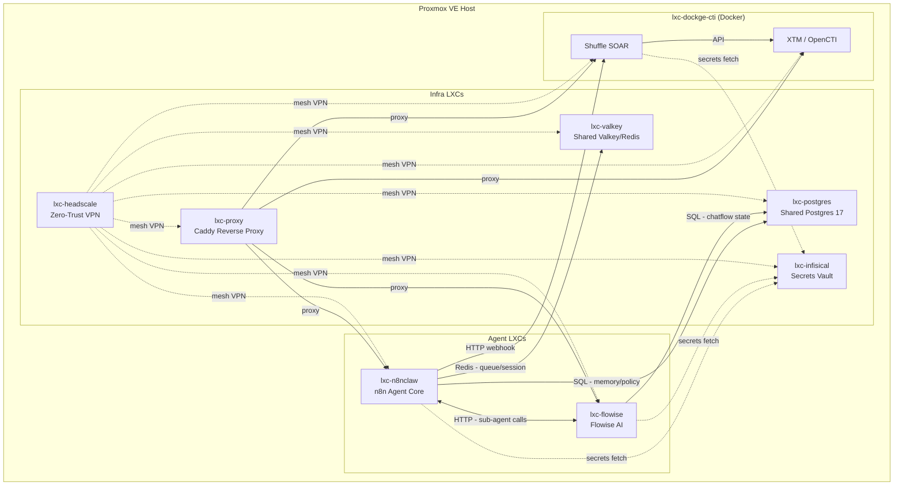

# YAOC2 Architecture

## Design Philosophy

YAOC2 separates concerns across three clear layers, mirroring the OpenClaw (reasoning) + NemoClaw (policy/safety) design but implemented entirely with self-hosted, Proxmox-native tooling:

```
┌──────────────────────────────────────────────────────────────────┐
│  LAYER 1: Reasoning & Skills (OpenClaw-equivalent)             │
│  • n8n (n8n-claw core)                                         │
│  • Flowise AI (pluggable sub-agent chains, called via HTTP)    │
│  • Postgres (long-term memory, project docs, MCP registry)    │
│  • Valkey (session state, queue)                               │
└──────────────────────────────────────────────────────────────────┘
          ↓ emits ProposedAction (JSON) only — never calls tools directly
┌──────────────────────────────────────────────────────────────────┐
│  LAYER 2: Policy Gateway (NemoClaw-equivalent)                 │
│  • n8n policy workflows                                        │
│  • policy/ YAML configs (tool allow/deny lists, risk levels)   │
│  • Human approval via Telegram / Slack                        │
│  • Audit log → Postgres (yaoc2_policy DB)                     │
└──────────────────────────────────────────────────────────────────┘
          ↓ only approved actions proceed
┌──────────────────────────────────────────────────────────────────┐
│  LAYER 3: Execution (Sandbox Workflows + Shuffle SOAR)         │
│  • sandbox.* n8n sub-workflows (scoped credentials)           │
│  • Shuffle playbooks for MISP / TheHive / OpenCTI actions     │
│  • XTM (OpenCTI + OpenAEV) via Dockge-CTI LXC                │
└──────────────────────────────────────────────────────────────────┘
```

## Proxmox LXC Topology



## ProposedAction Flow

```
User Message
    ↓
[n8n-claw Agent Brain] — reasons about intent, plans action
    ↓ POST /webhook/policy-gateway
    {
      "action_id": "uuid",
      "action_type": "misp.create_event",
      "resource": "misp",
      "parameters": {...},
      "risk_level": "medium",
      "user": "telegram:12345",
      "channel": "telegram",
      "timestamp": "ISO8601"
    }
    ↓
[Policy Gateway Workflow]
    ├─ Check policy/rules.yaml → allowed? risk_level?
    ├─ LOW risk → auto-approve
    ├─ MEDIUM risk → send Telegram approval request → wait
    └─ HIGH risk → auto-deny (if POLICY_HIGH_RISK_AUTO_DENY=true)
    ↓ approved
[Sandbox Workflow: sandbox.misp.create_event]
    ↓
[Shuffle Playbook or direct API call]
    ↓
Result returned to Agent → User
```

## Network Zones

| Zone | Services | Access |
|---|---|---|
| `yaoc2-net` (Headscale) | All LXCs | Mesh VPN, service-to-service |
| `yaoc2.local` (Caddy) | n8n, Flowise, XTM, Shuffle | Reverse proxy, TLS |
| Public (Cloudflare Tunnel) | n8n webhooks only | Optional, gated by auth |

## Key Design Decisions

1. **No direct LLM-to-tool calls**: The agent brain never holds credentials for production systems. All execution goes through the policy gateway and sandbox workflows.
2. **Separate LXCs, not Docker Compose services**: Each major component runs in its own LXC for blast-radius isolation. Only XTM and Shuffle (which require Docker) share the `lxc-dockge-cti` container.
3. **Flowise as a module, not the brain**: Flowise is used for specialized sub-agent chains (e.g., RAG, multi-step enrichment reasoning) and called by n8n via HTTP. n8n owns the memory and orchestration.
4. **Shuffle for SOAR actions**: Shuffle handles all high-privilege playbooks that touch CTI platforms, reducing attack surface in n8n.
5. **Infisical for all secrets**: No `.env` files with real credentials on disk in production. All LXC setup scripts pull from Infisical at boot.
